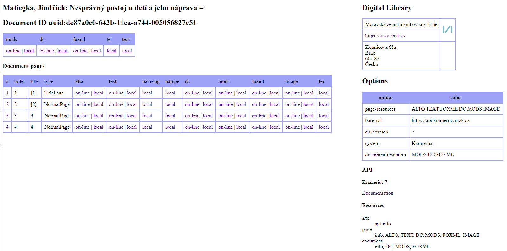
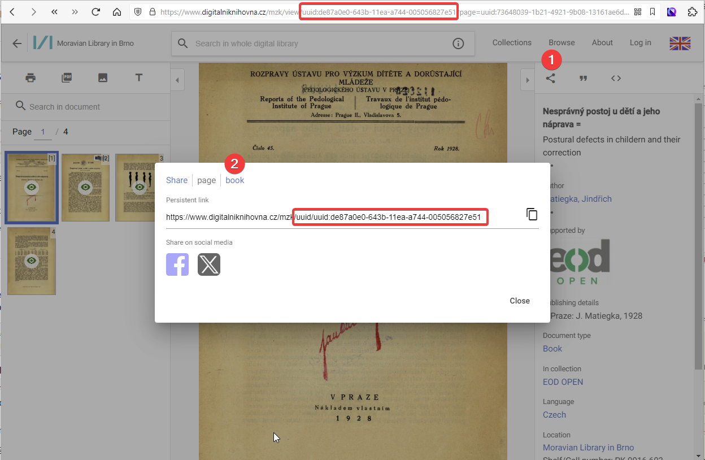

# Libri augmentati

XProc 3.0 Libraries for Digital Books Download and Enrichment

This software downloads all available (or selected) data and metadata, like [MODS](https://www.loc.gov/standards/mods/), [FOXML](https://wiki.lyrasis.org/display/FEDORA/All+Documentation), [DC](https://www.dublincore.org/specifications/dublin-core/), [ALTO](https://www.loc.gov/standards/alto/), and images, from digital libraries based on the system [Kramerius](https://system-kramerius.cz) and stores it on the local system.

This software also uses services provided by the [LINDAT/CLARIAH-CZ](https://lindat.cz "LINDAT/CLARIAH-CZ URL") Research Infrastructure (<https://lindat.cz> "LINDAT/CLARIAH-CZ Research Infrastructure"), supported by the Ministry of Education, Youth and Sports of the Czech Republic (Project No. [LM2023062](https://www.isvavai.cz/cep?ss=detail&n=0&h=LM2023062 "LM2023062 project details")).

`Librari augmentati` enriches textual data by morphosyntactic annotation using [UDPipe service](https://lindat.mff.cuni.cz/services/udpipe/ "UDPipe service") and named entity recognition by [NameTag service](https://lindat.mff.cuni.cz/services/nametag/ "NameTag service") developed and operated by the mentioned large research infrastructure.

Enriched textual data can be converted to [TEI P5](https://tei-c.org/release/doc/tei-p5-doc/en/html/index.html "TEI P5 Guidlines") format, both at the page level and the whole document level.

At this time, `Librari augmentati` only supports digital libraries provided by [Moravian Library in Brno](https://www.digitalniknihovna.cz/mzk "Digital library by Moravian Library in Brno") (Kramerius [version 7](https://github.com/ceskaexpedice/kramerius/wiki/Kramerius-REST-API-verze-7.0 "Wiki for Kramerius 7 Client API")) and [National Library](https://www.ndk.cz/ "Digital library by National Library") (Kramerius [version 5](https://github.com/ceskaexpedice/kramerius/wiki/ClientAPIDEV "Wiki for Kramerius 5 Client API")). Further libraries can be added to the [libraries.xml](src/settings/libraries.xml) settings file. See [registry](https://registr.digitalniknihovna.cz "Registry of the Kramerius systems") of all running instances of the Kramerius system.

## Prerequisites

- [Java 11](https://www.azul.com/downloads/?version=java-11-lts&package=jdk#zulu "Download Azul Zulu OpenJDK")
- [Saxon-HE 12.3](https://github.com/Saxonica/Saxon-HE/releases/tag/SaxonHE12-3 "Download SaxonHE12-3J")
- [MorganaXProc-IIIse 1.4.5](https://sourceforge.net/projects/morganaxproc-iiise/files/MorganaXProc-IIIse-1.4.5/ "Donwload MorganaXProc-IIIse 1.4.5")

### Enviroment setting

- [ ] Install Java JDK 11
- [ ] Extract content of the [MorganaXProc-IIIse-1.4.5.zip](https://sourceforge.net/projects/morganaxproc-iiise/files/MorganaXProc-IIIse-1.4.5/MorganaXProc-IIIse-1.4.5.zip/download "Donwload MorganaXProc-IIIse 1.4.5.zip file")
- [ ] Extract content of the [SaxonHE12-3J.zip](https://github.com/Saxonica/Saxon-HE/releases/download/SaxonHE12-3/SaxonHE12-3J.zip "Download SaxonHE12-3J") file
  - [ ]  copy extracted `saxon-he-12.3.jar` and `saxon-he-xqj-12.3.jar` files to the `MorganaXProc-IIIse_lib` folder
- [ ] On your operating system, set environment PATH variable to point to the location of the `MorganaXProc-IIIse` folder
- for example on Windows:
  - (run command line as administrator): `setx /m PATH "%PATH%;C:\Programs\MorganaXProc-IIIse"`
  - (run command line as usual user): `setx PATH "%PATH%;C:\Programs\MorganaXProc-IIIse"`

## How to use it

Clone the repository using Git

```shell
git clone https://github.com/moravianlibrary/libri-augmentati.git
```

or download [zipped](https://github.com/moravianlibrary/libri-augmentati/archive/refs/heads/main.zip) version of the repository.

Go to the [run](run) folder of this project and run one of the following command:

- [sample-book.cmd](run/sample-book.cmd) uses [sample-book.xpl](src/tests/xproc/sample-book.xpl) pipeline for downloading and processing [digital book](https://www.digitalniknihovna.cz/mzk/view/uuid:de87a0e0-643b-11ea-a744-005056827e51) from Moravian Library in Brno.
- in the [client.cmd](run/client.cmd) file you can set parameters of the book to be processed; this batch file uses [client.xpl](src/tests/xproc/client.xpl) pipeline
- in the [client-mzk.cmd](run/client-mzk.cmd) file change `-option:document-id` and `-option:nickname` argument and download (meta)data from Moravian Library in Brno, enrich them and convert to TEI
- in the [client-nkp.cmd](run/client-nkp.cmd) file change `-option:document-id` and `-option:nickname` argument and download (meta)data from National Library, enrich them and convert to TEI
- [test-samples.cmd](run/test-samples.cmd) uses [test-samples.xpl](src/tests/xproc/test-samples.xpl) pipeline for downloading and processing all books used as a sample in the [libraries.xml](src/settings/libraries.xml) settings file

After the data processing, a report (`report.html`) is generated in the selected folder from which you can access all the data locally or online in the original digital library.



When viewing a [title](https://www.digitalniknihovna.cz/mzk/view/uuid:de87a0e0-643b-11ea-a744-005056827e51?page=uuid:73648039-1b21-4921-9b08-13161ae6d239 "First page of the sample book") in a digital library, you can find the `document-id` of the publication in the URL. For example, the sample book is accessible via <https://www.digitalniknihovna.cz/mzk/view/uuid:de87a0e0-643b-11ea-a744-005056827e51?page=uuid:73648039-1b21-4921-9b08-13161ae6d239>. For the `document-id` use the first unique identifier, UUID, after `/view/`, in this case `uuid:de87a0e0-643b-11ea-a744-005056827e51`.

Or you can go through the sharing dialog where you have to select the `book` to share:



## Acknowledgment

The software was funded by the Institutional support for long term conceptual development of a research organization (The Moravian Library) by the Czech Ministry of Culture.
