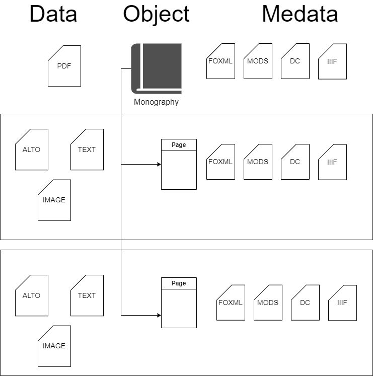

# Technická dokumentace k výsledku software (R)

## Cíl výsledku

Digitální knihovna [Kramerius](https://system-kramerius.cz) umožňuje uživatelům prohlížet publikace po jednotlivých stranách, tj. zobrazit naskenovaný obrázek nebo jeho textovou vrstvu. Uživatelské rozhraní umožňuje vygenerovat k vybrané publikaci PDF, ale pouze s omezeným počtem stran, který určuje provozovatel systému. Takový způsob práce se hodí pro čtení publikací, ale není ideální pro vědeckou analýzu celých děl, zejména s využitím moderních počítačových technologií, kdy je potřeba mít k dispozici kompletní texty jedné či více publikací ve standardizované podobě.

Softwarová aplikace `Libri augmentati` používá jednotný programový přístup k digitálním knihovnám a k službám, které analyzují a obohacují textová data. Obohacená data (aktuálně morfosyntaktická anotace s lemmatizací a rozpoznání pojmenovaných entit) se kombinují do jednoho formátu, kterým je [TEI P5](https://tei-c.org/release/doc/tei-p5-doc/en/html/index.html). Aplikace umožňuje stáhnout volně dostupná data a metadata z digitálních knihoven, která využívají systém [Kramerius](https://system-kramerius.cz), na zařízení uživatele pro další použití.

## Architektura softwarového řešení

Aplikace je navržená jako desktopová, spouštěná z příkazového řádku.

`Libri augmentati` komunikuje s jednotlivými službami, tj. digitálními knihovnami a aplikacemi pro obohacení textu, prostřednictvím dostupných programových rozhraní REST API.

Uživatel zadá identifikátor digitální publikace, s níž chce pracovat, a v které digitální knihovně je dostupná. Aplikace na základě několika dotazů vůči digitální knihovně vytvoří tzv. virtuální dokument, který obsahuje údaje o dostupných datech a metadatech pro celou publikaci a jednotlivé stránky, zachycený ve formátu XML.

- **Dostupná data a metadata v rámci digitálního knihoven**



- **Ukázka virtuálního dokumentu**

```xml
<lad:document xmlns:lad="https://www.mzk.cz/ns/libri-augmentati/documents/1.0">
<!-- -->
 <lad:resource available="true" type="mods" url="https://api.kramerius.mzk.cz/search/api/client/v7.0/items/uuid%3Abd9b4450-7ff1-11ef-a44c-5ef3fc9bb22f/metadata/mods" />
 <lad:resource available="true" type="dc" url="https://api.kramerius.mzk.cz/search/api/client/v7.0/items/uuid%3Abd9b4450-7ff1-11ef-a44c-5ef3fc9bb22f/metadata/dc" />
 <lad:resource available="true" type="foxml" url="https://api.kramerius.mzk.cz/search/api/client/v7.0/items/uuid%3Abd9b4450-7ff1-11ef-a44c-5ef3fc9bb22f/foxml" />
 <lad:pages>
  <lad:page order="1" id="uuid:56eda0d3-ca88-467f-8430-4c07d296aecc" title="[1a]" type="FrontCover">
   <lad:resource order="1" url="https://api.kramerius.mzk.cz/search/api/client/v7.0/items/uuid:56eda0d3-ca88-467f-8430-4c07d296aecc/ocr/alto" available="true" type="alto" />
   <lad:resource order="1" url="https://api.kramerius.mzk.cz/search/api/client/v7.0/items/uuid:56eda0d3-ca88-467f-8430-4c07d296aecc/ocr/text" available="true" type="text" />
   <lad:resource order="1" url="https://api.kramerius.mzk.cz/search/api/client/v7.0/items/uuid:56eda0d3-ca88-467f-8430-4c07d296aecc/metadata/dc" available="true" type="dc" />
   <lad:resource order="1" url="https://api.kramerius.mzk.cz/search/api/client/v7.0/items/uuid:56eda0d3-ca88-467f-8430-4c07d296aecc/metadata/mods" available="true" type="mods" />
   <lad:resource order="1" url="https://api.kramerius.mzk.cz/search/api/client/v7.0/items/uuid:56eda0d3-ca88-467f-8430-4c07d296aecc/foxml" available="true" type="foxml" />
   <lad:resource order="1" url="https://api.kramerius.mzk.cz/search/iiif/uuid:56eda0d3-ca88-467f-8430-4c07d296aecc/full/max/0/default.jpg" available="true" type="image" />
  </lad:page>
 </lad:pages>
 <!-- -->
</lad:document>
```

Po sestavení virtuálního dokumentu dojde ke stažení dat a metadat pro celou publikaci a jednotlivé stránky.

V další fázi dochází k obohacování dat, v jehož průběhu se textová data odesílají na webové služby a vrácené výsledky se jednak uchovávají v originálním formátu (např. XML nebo v prostém textu) a zároveň se převádějí do formátu TEI, který má k dispozici prostředky pro konverzi z těchto formátů při zachování všech podstatných informací a metadat (např. o použité verzi externí aplikace a datového modelu).

- **Ukázka obohacených dat ve formátu XML** (služba [NameTag](https://lindat.mff.cuni.cz/services/nametag/))

```xml
 <sentence>
  <token>Během</token>
  <token>posledních</token>
  <ne type="nc">
   <token>15</token>
  </ne>
  <token>—</token>
  <ne type="nc">
   <token>20</token>
  </ne>
  <token>let</token>
  <token>věnuje</token>
  <token>se</token>
  <token>v</token>
  <ne type="gt">
   <token>Americe</token>
  </ne>
  <token>opravě</token>
  <token>postoje</token>
  <token>u</token>
  <token>mládeže</token>
  <token>zvláštní</token>
  <token>pozornost</token>
  <token>.</token>
 </sentence>
 <sentence>
```

- **Ukázka obohacených dat ve formátu [CoNLL-U](https://universaldependencies.org/docs/format.html)** (služba [UDPipe](https://lindat.mff.cuni.cz/services/udpipe/))

```plaintext
# newpar
# sent_id = 3
# text = Během posledních 15 — 20 let věnuje se v Americe opravě postoje u mládeže zvláštní pozornost .
1	Během	během	ADP	RR--2----------	AdpType=Prep|Case=Gen	6	case	_	SpacesAfter=

2	posledních	poslední	ADJ	AANP2----1A----	Case=Gen|Degree=Pos|Gender=Neut|Number=Plur|Polarity=Pos	6	amod	_	SpacesAfter=

3	15	15	NUM	C=-------------	NumForm=Digit|NumType=Card	6	nummod	_	SpacesAfter=

4	—	—	PUNCT	Z:-------------	_	5	cc	_	SpacesAfter=

5	20	20	NUM	C=-------------	NumForm=Digit|NumType=Card	3	conj	_	SpacesAfter=

6	let	léta	NOUN	NNNP2-----A----	Case=Gen|Gender=Neut|Number=Plur	7	obl	_	SpacesAfter=

7	věnuje	věnovat	VERB	VB-S---3P-AAI--	Aspect=Imp|Mood=Ind|Number=Sing|Person=3|Polarity=Pos|Tense=Pres|VerbForm=Fin|Voice=Act	0	root	_	SpacesAfter=

8	se	se	PRON	P7-X4----------	Case=Acc|PronType=Prs|Reflex=Yes|Variant=Short	7	expl:pass	_	SpacesAfter=

9	v	v	ADP	RR--6----------	AdpType=Prep|Case=Loc	10	case	_	SpacesAfter=

10	Americe	Amerika	PROPN	NNFS6-----A----	Case=Loc|Gender=Fem|NameType=Geo|Number=Sing	7	obl	_	SpacesAfter=

11	opravě	oprava	NOUN	NNFS3-----A----	Case=Dat|Gender=Fem|Number=Sing	7	obl:arg	_	SpacesAfter=

12	postoje	postoj	NOUN	NNIS2-----A----	Animacy=Inan|Case=Gen|Gender=Masc|Number=Sing	11	nmod	_	SpacesAfter=

13	u	u	ADP	RR--2----------	AdpType=Prep|Case=Gen	14	case	_	SpacesAfter=

14	mládeže	mládež	NOUN	NNFS2-----A----	Case=Gen|Gender=Fem|Number=Sing	12	nmod	_	SpacesAfter=

15	zvláštní	zvláštní	ADJ	AAFS1----1A----	Case=Nom|Degree=Pos|Gender=Fem|Number=Sing|Polarity=Pos	16	amod	_	SpacesAfter=

16	pozornost	pozornost	NOUN	NNFS1-----A----	Case=Nom|Gender=Fem|Number=Sing	7	nsubj:pass	_	SpacesAfter=

17	.	.	PUNCT	Z:-------------	_	7	punct	_	SpacesAfter=

```

- **Ukázka obohacených dat ve formátu TEI**

```xml
<s xmlns="http://www.tei-c.org/ns/1.0">
   <w n="1" lemma="během" pos="ADP" msd="AdpType=Prep|Case=Gen">Během</w>
   <w n="2" lemma="poslední" pos="ADJ" msd="Case=Gen|Degree=Pos|Gender=Neut|Number=Plur|Polarity=Pos">posledních</w>
   <num ana="#nametag-nc">
      <w n="3" lemma="15" pos="NUM" msd="NumForm=Digit|NumType=Card">15</w>
   </num>
   <pc n="4" lemma="—" pos="PUNCT" msd="_">—</pc>
   <num ana="#nametag-nc">
      <w n="5" lemma="20" pos="NUM" msd="NumForm=Digit|NumType=Card">20</w>
   </num>
   <w n="6" lemma="léta" pos="NOUN" msd="Case=Gen|Gender=Neut|Number=Plur">let</w>
   <w n="7" lemma="věnovat" pos="VERB" msd="Aspect=Imp|Mood=Ind|Number=Sing|Person=3|Polarity=Pos|Tense=Pres|VerbForm=Fin|Voice=Act">věnuje</w>
   <w n="8" lemma="se" pos="PRON" msd="Case=Acc|PronType=Prs|Reflex=Yes|Variant=Short">se</w>
   <w n="9" lemma="v" pos="ADP" msd="AdpType=Prep|Case=Loc">v</w>
   <geogName ana="#nametag-gt" type="continent">
      <w n="10" lemma="Amerika" pos="PROPN" msd="Case=Loc|Gender=Fem|NameType=Geo|Number=Sing">Americe</w>
   </geogName>
   <w n="11" lemma="oprava" pos="NOUN" msd="Case=Dat|Gender=Fem|Number=Sing">opravě</w>
   <w n="12" lemma="postoj" pos="NOUN" msd="Animacy=Inan|Case=Gen|Gender=Masc|Number=Sing">postoje</w>
   <w n="13" lemma="u" pos="ADP" msd="AdpType=Prep|Case=Gen">u</w>
   <w n="14" lemma="mládež" pos="NOUN" msd="Case=Gen|Gender=Fem|Number=Sing">mládeže</w>
   <w n="15" lemma="zvláštní" pos="ADJ" msd="Case=Nom|Degree=Pos|Gender=Fem|Number=Sing|Polarity=Pos">zvláštní</w>
   <w n="16" lemma="pozornost" pos="NOUN" msd="Case=Nom|Gender=Fem|Number=Sing">pozornost</w>
   <pc n="17" lemma="." pos="PUNCT" msd="_">.</pc>
</s>
```

V další fázi se z jednotlivých stran a metadat o publikaci vytvoří jeden dokument TEI, který obsahuje většinu shromážděných údajů.

Na závěr se vygeneruje webová stránka, na níž jsou v přehledné podobě k dispozici odkazy na jednotlivá data či metadata, ať už on-line, nebo lokálně uložená.

Architektura je navržena tak, aby bylo možné komunikovat i dalšími digitálními knihovnami, které v základu využívají jiná data a metadata, jako je např. [Bayerische Staatsbibliothek](https://www.digitale-sammlungen.de) a [Biblioteka Narodowa](https://polona.pl).

## Implementace softwarového řešení

Softwarová aplikace `Libri augmentati` je tvořena několika knihovnami v programovacím jazyce [XProc 3.0](https://xproc.org/specifications.html). Pro její běh se využívá knihovna [MorganaXProc-IIIse](https://www.xml-project.com/morganaxproc-iiise.html).

Vstupní bod aplikace tvoří knihovna [`libri-augmentati.xpl`](./src/xproc/libri-augmentati.xpl), která zapouzdřuje volání kroků z dalších knihoven, které jsou určeny jednak pro komunikaci s webovými službami prostřednictvím REST API, např. [`kramerius-5.xpl`](./src/xproc/kramerius-5.xpl) a [`kramerius-7.xpl`](./src/xproc/kramerius-7.xpl) pro digitální knihovny nebo obecně pro obohacení dat [`udpipe.xpl`](./src/xproc/nametag.xpl). Posledně jmenovaná knihovna volá kroky v knihovnách [`nametag.xpl`](./src/xproc/nametag.xpl) a [`udpipe.xpl`](./src/xproc/udpipe.xpl), které komunikují s webovými službami pro obohacení textu.

Další knihovny mají pomocný charakter a slouží zejména pro konverzi do formátu TEI ([`tei.xpl`](./src/xproc/tei.xpl)) nebo jiných ([`conversion.xpl`](./src/xproc/conversion.xpl)) a obecně pro práci s textovými dokumenty ([`text.xpl`](./src/xproc/text.xpl)).

Nastavení je uloženo ve složce [settings](./src/settings/), a to jednak informace o [digitálních knihovnách](./src/settings/libraries.xml) a [službách pro obohacení](./src/settings/services.xml).

XSLT transformace, které se používají v rámci některých kroků v jazyce XProc 3.0, jsou uloženy v podsložkách adresáře [xlst](./src/xslt/).

Aplikace využívá také externí komponenty, zejména pro generování dokumentace (viz [xproc-analyzer-3.0.xpl](./src/includes/xdoc-xpl-lib/src/xproc/xproc-analyzer-3.0.xpl)).

Jednotlivé knihovny jsou zdokumentovány ve zdrojovém kódu a v samostatné [dokumentaci](./doc/README.html).

## Proč výsledek nenaplňuje negativní část definice softwaru

- vývoj software obchodních aplikací a informačních systémů za použití známých metod a stávajících softwarových nástrojů
  - `Libri augmentati` využívá stávající softwarové nástroje, jako ostatně téměř všechny aplikace, včetně operačních systémů; nejedná se však o obchodní aplikaci, ale volně dostupný software, který neplní roli informačního systému
- přidání uživatelských funkcí do stávajících aplikačních programů (včetně funkčnosti základních vstupních dat)
  - `Libri augmentati` je zcela nová aplikace, dosud nikde nevykazovaná
- tvorba webových stránek či software s využitím stávajících nástrojů
  - `Libri augmentati` neslouží k tvorbě webových stránek, jedná se o software, který využívá stávající nástroje, jako je např. běhové prostředí pro programovací jazyk XProc 3.0, běhové prostředí Java, nebo aplikaci pro XSLT transformace
- použití standardních metod kódování, ověřování zabezpečení a testování integrity dat
  - `Libri augmentati` používá standardní metody, kdyby je nepoužíval, nemohl by fungovat; novum aplikace spočívá v jednotném přístupu k různým verzím digitálních knihoven a ve sloučení různorodých obohacujících informací do jednoho dokumentu
- přizpůsobení výrobku pro konkrétní použití, nejsou-li v průběhu tohoto procesu přidány poznatky, které výrazně vylepšují základní program
  - `Libri augmentati` je zcela nová aplikace
- rutinní ladění stávajících systémů a programů, pokud se tak neděje před koncem procesu experimentálního vývoje
  - `Libri augmentati` bylo samozřejmě potřeba před dokončením ostré verze ladit, aby jeho uživatelé nenaráželi na chyby, které by znemožnily používání aplikace ke stahování a obohacování dat

## Využití programovacích jazyků

`Libri augmentati` využívá deklarativní programovací jazyk [XProc 3.0](https://xproc.org/specifications.html), který je zapisován pomocí standardu XML. Novější verze tohoto jazyka nativně podporuje všechny potřebné protokoly (HTTP(S)) a formáty (JSON, XML, TXT), které se v digitálních knihovnách a službách pro obohacení jazykových dat využívají.

Jako nosič dat (pro virtuální dokument, popř. nastavení aplikace) se používá nově vytvořená specifikace XML s vlastním jmenným prostorem. To zaručuje další rozšiřitelnost o nové typy dat nebo služeb.

Ke spuštění programu se používá běhové prostředí, pro nějž v současné době existuje pouze jedna implementace ([MorganaXProc-IIIse](https://www.xml-project.com/morganaxproc-iiise.html)), ale v dohledné době se objeví další ([XML Calabash 3](https://xmlcalabash.com)).

Pokud je mi známo, představuje `Libri augmentati` jedinou aplikaci v programovacím jazyce XProc 3.0, která umí získávat data z digitálních knihoven se systémem [Kramerius](https://system-kramerius.cz) a služeb pro obohacování dat.

K běhu aplikace a práci s daty (volání webových služeb, ukládání, konverze či slučování) se používá deklarativní přístup, a to pomocí jazyka [XProc 3.0](https://xproc.org/specifications.html) a [XSLT 3.0](https://www.w3.org/TR/xslt-30/).
